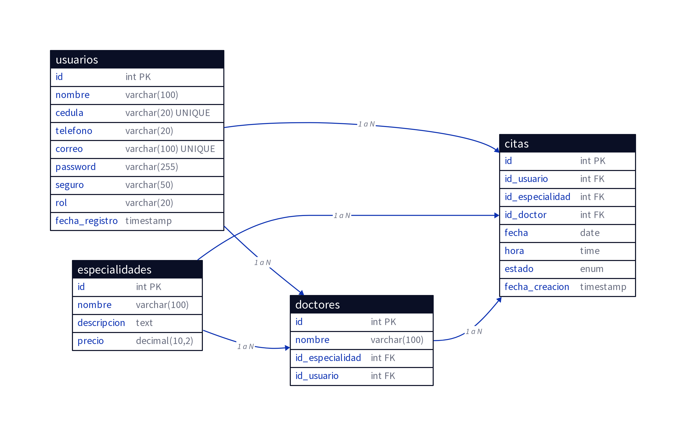

# DOCUMENTACIÓN DEL PROYECTO - CITAS MÉDICAS

## Hospital & Human - Sistema de Gestión de Citas Médicas

**Versión:** 0.5  
**Fecha:** Marzo 2026  
**Autor:** Melvyn liberata Torres
**Institución:** ITSC - Laboratorio SOF-109

---

## 📋 Tabla de Contenidos

1. [Descripción General](#descripción-general)
2. [Requisitos Técnicos](#requisitos-técnicos)
3. [Estructura del Proyecto](#estructura-del-proyecto)
4. [Instalación y Configuración](#instalación-y-configuración)
5. [Funcionalidades Principales](#funcionalidades-principales)
6. [Modelo Entidad-Relación](#modelo-entidad-relación)
7. [Guía de Uso](#guía-de-uso)
8. [Buenas Prácticas Implementadas](#buenas-prácticas-implementadas)
9. [Sugerencias de Mejora](#sugerencias-de-mejora)

---

## 🏥 Descripción General

**Hospital & Human** es un sistema web completo para la gestión de citas médicas que permite a los pacientes agendar consultas con especialistas médicos, visualizar información sobre especialidades y doctores, y gestionar sus citas. El sistema también proporciona un panel de administración para que los administradores gestionen doctores, especialidades, usuarios y citas.

### Características Principales:

- **Autenticación de Usuarios:** Sistema de login/registro con roles diferenciados (paciente, doctor, administrador)
- **Gestión de Especialidades:** Listado completo de especialidades médicas con información detallada
- **Agendamiento de Citas:** Interface intuitiva para agendar citas con doctores específicos
- **Cálculo de Precios:** Sistema de precios dinámico con descuentos para pacientes con seguro médico (75% de descuento)
- **Panel de Administración:** Gestión completa de doctores, especialidades, usuarios y citas
- **Panel de Usuario:** Visualización y gestión de citas personales
- **Diseño Responsivo:** Interface moderna y adaptable a dispositivos móviles
- **Seguridad:** Contraseñas cifradas, validaciones robustas, prevención de inyección SQL

---

## 🔧 Requisitos Técnicos

### Stack Tecnológico:

| Componente | Versión | Descripción |
|-----------|---------|-------------|
| **PHP** | 7.4+ | Lenguaje backend |
| **MySQL** | 5.7+ / MariaDB 10.3+ | Sistema gestor de base de datos |
| **HTML5** | - | Estructura del frontend |
| **CSS3** | - | Estilos y animaciones |
| **JavaScript** | ES6+ | Validaciones y interactividad |
| **PDO** | - | Conexión segura a la base de datos |

### Requisitos del Sistema:

- **Servidor Web:** Apache 2.4+ o Nginx
- **PHP Extensions:** PDO, PDO_MySQL, OpenSSL
- **Navegador:** Chrome, Firefox, Safari, Edge (versiones recientes)
- **Espacio en Disco:** Mínimo 50 MB

---

## 📁 Estructura del Proyecto

```
citas-medicas/
├── admin/                          # Panel de administración
│   ├── dashboard.php              # Dashboard principal del admin
│   ├── doctores.php               # Gestión de doctores
│   ├── especialidades.php         # Gestión de especialidades
│   ├── citas.php                  # Gestión de citas
│   ├── usuarios.php               # Gestión de usuarios
│   └── ajax/                      # Operaciones AJAX
│       ├── agregar_doctor.php
│       ├── editar_doctor.php
│       ├── eliminar_doctor.php
│       ├── agregar_especialidad.php
│       ├── editar_especialidad.php
│       ├── eliminar_especialidad.php
│       ├── agregar_cita.php
│       ├── editar_cita.php
│       ├── eliminar_cita.php
│       ├── cambiar_estado_cita.php
│       ├── agregar_usuario.php
│       ├── editar_usuario.php
│       ├── eliminar_usuario.php
│       ├── cambiar_rol_usuario.php
│       └── get_doctores.php
├── auth/                           # Autenticación
│   ├── login.php                  # Página de login
│   ├── register.php               # Página de registro
│   └── logout.php                 # Cerrar sesión
├── config/                         # Configuración
│   └── db.php                     # Conexión a base de datos (PDO)
├── user/                           # Panel de usuario
│   ├── dashboard.php              # Dashboard del usuario
│   ├── agendar.php                # Formulario para agendar cita
│   ├── mis_citas.php              # Visualizar citas del usuario
│   ├── get_doctores.php           # AJAX para obtener doctores
│   └── agendar_ajax.php           # AJAX para agendar cita
├── especialidades/                 # Información de especialidades
│   ├── index.php                  # Listado de especialidades
│   └── ver.php                    # Detalle de especialidad
├── assets/                         # Recursos estáticos
│   ├── css/
│   │   └── style.css              # Estilos globales
│   ├── js/
│   │   ├── main.js                # Lógica principal
│   │   ├── script.js              # Scripts adicionales
│   │   └── validaciones.js        # Validaciones del cliente
│   └── img/
│       └── logo.png               # Logo de la empresa
├── includes/                       # Includes globales
│   ├── header.php                 # Header reutilizable
│   └── footer.php                 # Footer reutilizable
├── index.php                       # Página principal
├── database.sql                    # Script SQL 
├── DOCUMENTACION_PROYECTO.md       # Esta documentación
├── README.md                       # Readme del proyecto
```

---

## 🚀 Instalación y Configuración

### Paso 1: Preparar el Entorno

1. **Instalar XAMPP o similar:**
   - Descargar desde [https://www.apachefriends.org/](https://www.apachefriends.org/)
   - Instalar en tu computadora
   - Iniciar Apache y MySQL

2. **descargar el proyecto:**
   ```bash
   Desde Google Drive
   ```

### Paso 2: Configurar la Base de Datos

1. **Abrir phpMyAdmin:**
   - Ir a `http://localhost/phpmyadmin`
   - Usar usuario: `root` (sin contraseña por defecto)

2. **Importar el script SQL:**
   - Ir a la pestaña "Importar"
   - Seleccionar el archivo `database.sql`
   - Hacer clic en "Continuar"
   - La base de datos `citas_medicas` se creará automáticamente

**Alternativa (línea de comandos):**
```bash
mysql -u root -p < database.sql
```

### Paso 3: Configurar la Conexión

El archivo `config/db.php` ya está configurado para conexión local:

```php
$host = "localhost";
$db   = "citas_medicas";
$user = "root";
$pass = "";
```

Si necesitas cambiar estos valores, edita el archivo según tu configuración.

### Paso 4: Colocar el Proyecto en la Carpeta Web

1. **Copiar la carpeta del proyecto a:**
   - En XAMPP: `C:\xampp\htdocs\Citas-Medicas` (Windows)
   - En XAMPP: `/Applications/XAMPP/htdocs/Citas-Medicas` (Mac)
   - En XAMPP: `/opt/lampp/htdocs/Citas-Medicas` (Linux)

### Paso 5: Acceder al Proyecto

1. **Abrir en el navegador:**
   ```
   http://localhost/Citas-Medicas/
   ```

2. **Credenciales de Prueba:**
   - **Admin:**
     - Email: `admin@hospitalandhuman.com`
     - Contraseña: `123456`
   - **Doctor:**
     - Email: `dr.luis@hospitalandhuman.com`
     - Contraseña: `123456`
   - **Paciente:** Crear nuevo registro

---

## ✨ Funcionalidades Principales

### 1. Página Principal (index.php)

La página de inicio presenta:
- Logo dinámico que se desplaza al hacer scroll
- Sección hero con bienvenida
- Información sobre la institución (Quiénes somos, Misión, Visión)
- Listado de especialidades médicas
- Llamada a la acción para agendar citas
- Acceso a login/registro

**Características técnicas:**
- Animaciones suaves tipo Flutter
- Responsive design completo
- Efecto de scroll dinámico en el header
- Colorimetría profesional (azul marino, azul claro, blanco)

### 2. Registro de Usuarios (auth/register.php)

Permite a nuevos pacientes crear una cuenta con:
- Validación de campos (nombre, cédula, teléfono, correo, contraseña)
- Selección de seguro médico (ARS o privado)
- Prevención de duplicados (correo, cédula)
- Cifrado de contraseña con `password_hash()`
- Mensajes de error/éxito claros

**Validaciones implementadas:**
- Nombre: mínimo 3 caracteres
- Cédula: 9-11 dígitos (formato dominicano)
- Teléfono: 7-15 dígitos
- Email: formato válido
- Contraseña: mínimo 6 caracteres

### 3. Login (auth/login.php)

Autenticación segura con:
- Validación de credenciales
- Verificación de contraseña con `password_verify()`
- Creación de sesión
- Redirección según rol (admin → admin/dashboard, user → user/dashboard)

### 4. Especialidades (especialidades/ver.php)

Página de detalle de especialidad que muestra:
- Información completa de la especialidad
- Descripción y detalles
- **Cálculo de precios:**
  - Precio sin seguro: 100%
  - Precio con seguro: 25% del precio original (75% de descuento)
- Listado de doctores disponibles
- Botón para agendar cita
- Disponibilidad de doctores

### 5. Agendamiento de Citas (user/agendar.php)

Interface para agendar citas con:
- Selección de especialidad
- Carga dinámica de doctores según especialidad (AJAX)
- Selección de fecha (validación de fechas futuras)
- Selección de hora
- Validación de horarios disponibles
- Confirmación de cita

### 6. Panel de Usuario (user/dashboard.php)

Dashboard del usuario con acceso a:
- Agendar nueva cita
- Ver mis citas
- Volver al inicio
- Cerrar sesión

### 7. Panel de Administración (admin/dashboard.php)

Dashboard del administrador con acceso a:
- Gestión de doctores (CRUD)
- Gestión de especialidades (CRUD)
- Gestión de citas
- Gestión de usuarios
- Estadísticas del sistema

---

## 📊 Modelo Entidad-Relación

### Tablas Principales:

#### 1. **USUARIOS**
```
usuarios
├── id (PK)
├── nombre
├── cedula (UNIQUE)
├── telefono
├── correo (UNIQUE)
├── password (hash)
├── seguro
├── rol (user, doctor, admin)
└── fecha_registro
```

#### 2. **ESPECIALIDADES**
```
especialidades
├── id (PK)
├── nombre
├── descripcion
└── precio
```

#### 3. **DOCTORES**
```
doctores
├── id (PK)
├── nombre
├── id_especialidad (FK → especialidades.id)
└── id_usuario (FK → usuarios.id)
```

#### 4. **CITAS**
```
citas
├── id (PK)
├── id_usuario (FK → usuarios.id)
├── id_especialidad (FK → especialidades.id)
├── id_doctor (FK → doctores.id)
├── fecha
├── hora
├── estado (pendiente, confirmada, cancelada)
└── fecha_creacion
```

### Diagrama Entidad-Relación



---

## 👥 Guía de Uso

### Para Pacientes:

1. **Registrarse:**
   - Ir a "Registro"
   - Completar formulario con datos personales
   - Seleccionar tipo de seguro
   - Hacer clic en "Registrarse"

2. **Agendar Cita:**
   - Iniciar sesión
   - Ir a "Agendar Cita"
   - Seleccionar especialidad
   - Seleccionar doctor
   - Seleccionar fecha y hora
   - Confirmar cita

3. **Ver Mis Citas:**
   - Iniciar sesión
   - Ir a "Ver Mis Citas"
   - Ver listado de citas agendadas
   - Ver estado de cada cita

### Para Administradores:

1. **Gestionar Doctores:**
   - Ir a "Admin" → "Doctores"
   - Agregar, editar o eliminar doctores
   - Asignar especialidad a cada doctor

2. **Gestionar Especialidades:**
   - Ir a "Admin" → "Especialidades"
   - Agregar, editar o eliminar especialidades
   - Establecer precios

3. **Gestionar Citas:**
   - Ir a "Admin" → "Citas"
   - Ver todas las citas del sistema
   - Cambiar estado de citas
   - Eliminar citas si es necesario

4. **Gestionar Usuarios:**
   - Ir a "Admin" → "Usuarios"
   - Ver listado de usuarios
   - Cambiar roles de usuarios
   - Eliminar usuarios

---

## 🛡️ Buenas Prácticas Implementadas

### 1. **Seguridad**

- **Cifrado de Contraseñas:** Uso de `password_hash()` con algoritmo PASSWORD_DEFAULT
- **Validación de Entrada:** Trim, filter_var, expresiones regulares
- **Prepared Statements:** Prevención de inyección SQL con PDO
- **Sesiones Seguras:** Validación de sesión en cada página protegida
- **HTTPS Ready:** Estructura preparada para HTTPS en producción

### 2. **Validaciones**

- **Cliente (JavaScript):** Validaciones en tiempo real para mejor UX
- **Servidor (PHP):** Validaciones robustas de todos los datos de entrada
- **Campos Obligatorios:** Validación de presencia de datos
- **Formato:** Validación de email, cédula, teléfono, fechas
- **Duplicados:** Prevención de correos y cédulas duplicadas

### 3. **Diseño y UX**

- **Responsive Design:** Funciona en desktop, tablet y móvil
- **Animaciones Suaves:** Transiciones CSS3 para mejor experiencia
- **Mensajes Claros:** Feedback visual de éxito/error
- **Navegación Intuitiva:** Estructura lógica y fácil de seguir
- **Accesibilidad:** Etiquetas HTML5 semánticas, atributos alt en imágenes

### 4. **Rendimiento**

- **Throttling en Scroll:** Optimización de eventos de scroll
- **Índices en BD:** Índices en columnas frecuentemente consultadas
- **Lazy Loading:** Carga eficiente de recursos
- **Minificación:** CSS y JS optimizados

### 5. **Documentación**

- **Comentarios en Código:** Documentación detallada de funciones y lógica
- **PHPDoc:** Comentarios de documentación en funciones PHP
- **README:** Instrucciones de instalación y uso
- **Documentación Técnica:** Este documento

### 6. **Mantenibilidad**

- **Estructura Modular:** Separación de concerns (config, auth, admin, user)
- **Reutilización de Código:** Funciones globales en validaciones.js y main.js
- **Convenciones de Nombres:** Nombres claros y consistentes
- **Control de Versiones:** Preparado para Git

---

## 💡 Sugerencias de Mejora

### Corto Plazo:

1. **Notificaciones por Email:**
   - Enviar confirmación de registro
   - Recordatorio de citas 24 horas antes
   - Confirmación de agendamiento

2. **Búsqueda Avanzada:**
   - Filtrar doctores por especialidad
   - Filtrar citas por estado
   - Búsqueda de usuarios por nombre/cédula

3. **Reportes:**
   - Reporte de citas por especialidad
   - Reporte de doctores más solicitados
   - Estadísticas de ocupación

### Mediano Plazo:

1. **Autenticación Mejorada:**
   - Autenticación de dos factores (2FA)
   - Recuperación de contraseña por email
   - Cambio de contraseña

2. **Historial de Citas:**
   - Visualizar citas pasadas
   - Descargar comprobantes
   - Calificación de doctores

3. **Disponibilidad de Doctores:**
   - Horarios específicos por doctor
   - Días no disponibles
   - Vacaciones

### Largo Plazo:

1. **Integración de Pagos:**
   - Pago en línea de citas
   - Integración con sistemas de seguros
   - Facturación automática

2. **Aplicación Móvil:**
   - App iOS/Android
   - Notificaciones push
   - Acceso offline

3. **Telemedicina:**
   - Consultas por video
   - Chat médico-paciente
   - Prescripciones digitales

4. **Inteligencia Artificial:**
   - Recomendación de especialistas
   - Predicción de no-shows
   - Análisis de patrones de citas

---

## 📞 Soporte y Contacto

Para preguntas o problemas técnicos, contactar a:

- **Email:** info@hospitalandhuman.com
- **Teléfono:** +1 (849) 350-9603
- **Sitio Web:** www.hospitalandhuman.com

---

## 📄 Licencia

Este proyecto es de uso académico y está protegido bajo la licencia MIT.

---

## ✅ Checklist de Implementación

- [x] Lenguaje PHP backend
- [x] Base de datos MySQL con PDO
- [x] HTML5 y CSS3
- [x] JavaScript para validaciones
- [x] Sistema de sesiones
- [x] Roles diferenciados (admin, user)
- [x] Operaciones CRUD completas
- [x] Validaciones cliente y servidor
- [x] Contraseñas cifradas (password_hash)
- [x] Mensajes de error/éxito
- [x] Documentación del código
- [x] Diseño responsivo
- [x] Animaciones y transiciones
- [x] Seguridad (prepared statements)
- [x] Script SQL de base de datos
- [x] Diagrama ER
- [x] Documentación técnica

---

**Documento generado:** 18 de Marzo de 2026  
**Versión:** 2.0  
**Estado:** Completado ✓
